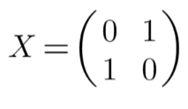

# Chapter 4: The Pauli-X gate 

The Pauli X gate is called the bit flip gate because it ends up swapping the probability amplitudes 'α' and  'β' with each other. We normally use the letter 'X' to represent the Pauli-X gate, mathematically it can be expressed using the matrix below:

The state of our qubit can be expressed as a linear combination of the basis vectors with 'α' and 'β' being the probability amplitudes as follows:

Using simple algebra, this is how we would express the X-gate:

Notice that 'α' and 'β' are flipped and the similarity between the behavior of the CNOT gate.  

*Note: The number of qubits required in the circuit for this gate is '1.'*
